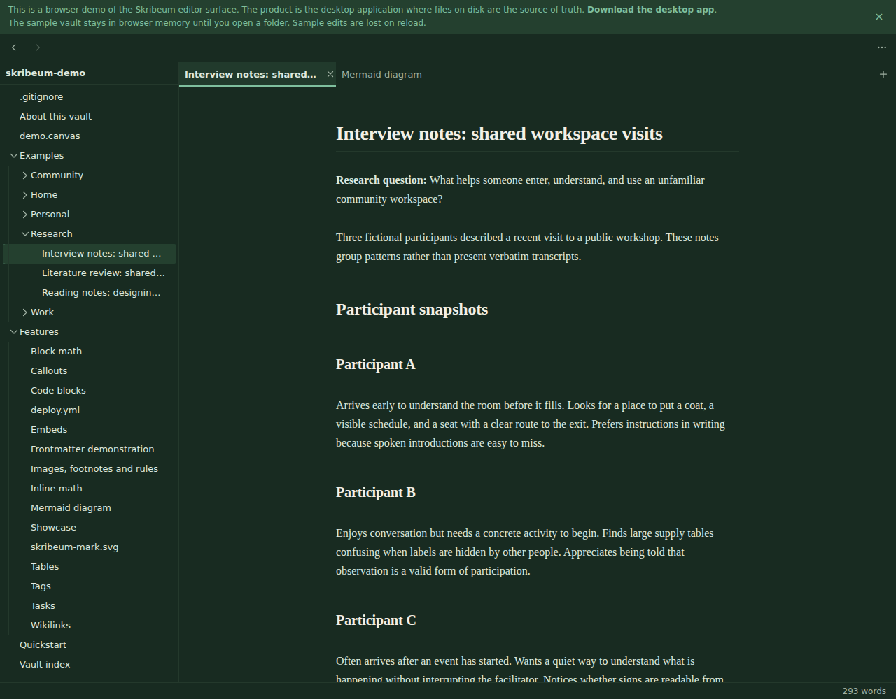
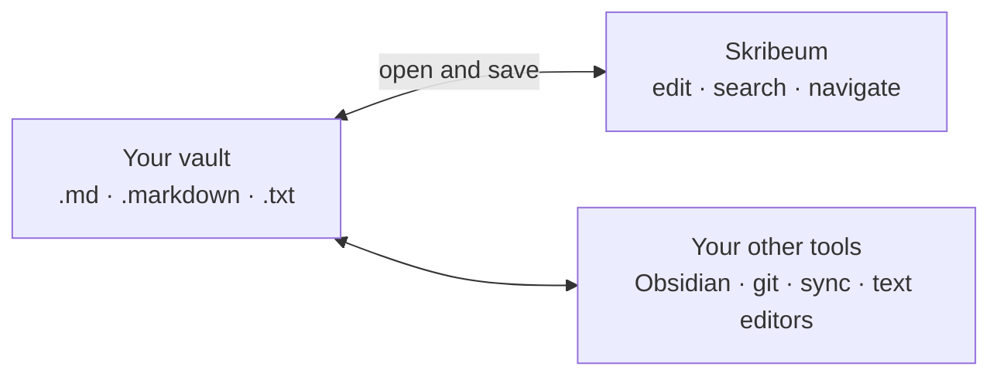

<h1 align="center">
  
</h1>

<p align="center">
  A local-first Markdown editor for Obsidian-compatible vaults.
  Your files stay plain, portable, and yours.
</p>

<p align="center">
  <a href="https://skribeum.app/"><strong>Try the web demo</strong></a>
  ·
  <a href="https://github.com/morgaesis/skribeum/releases">Download the desktop app</a>
  ·
  <a href="#build-from-source">Build from source</a>
</p>

<a href="https://skribeum.app/">
  
</a>

## Why Skribeum

- **Your vault is the database.** Skribeum opens `.md`, `.markdown`, and `.txt`
  files directly, alongside the tools that already use them.
- **Edits stay contained.** Saving preserves bytes outside the range you changed,
  including line endings and untouched frontmatter.
- **Markdown stays readable while you write.** Formatting renders in place, and
  source mode is one shortcut away.

## Start here

1. **Explore without installing:** open the
   [browser demo](https://skribeum.app/). It starts with a guided sample vault.
2. **Use a real vault:** get a pre-release build from
   [GitHub Releases](https://github.com/morgaesis/skribeum/releases), back up your
   vault, then choose **Open vault**.
3. Press <kbd>Ctrl</kbd>/<kbd>Cmd</kbd> + <kbd>K</kbd> to find notes, commands,
   tags, settings, and full-text search from one place.

## What it handles

- Live Markdown editing with source reveal, syntax highlighting, math, Mermaid,
  code, callouts, embeds, tables, and configurable task states
- Wikilinks, tags, heading links, link previews, vault search, and in-note find
- Frontmatter properties that preserve untouched YAML
- Tabs, split panes, navigation history, and restored workspaces
- Interactive JSON Canvas boards and image viewing
- Light and dark palettes, touch layouts, and keyboard-accessible controls

## Your files remain the source of truth



The desktop app reads and writes the vault on disk. Its edit history and
settings live in the operating system's application-data directory, outside
the vault. Edit history can include text removed from a note; run
`Note: clear edit history` to remove it for the active note.

## Desktop app and browser demo

| | Desktop app | Browser demo |
| --- | --- | --- |
| Starts with | A folder you choose | A seeded sample vault |
| Storage | Files on disk | Memory for the sample vault |
| Local folders | Reads and writes through the desktop filesystem | Available in browsers with the File System Access API |
| Edit history | Persists outside the vault | Lasts for the page session |
| Best for | Working with backed-up vaults | Exploring the editor |

The demo reports its storage mode above the editor. Sample-vault edits disappear
on reload. A local folder writes through only when the browser grants permission
and supports writable file handles. Browser folder writes cannot atomically
detect concurrent external changes, so use a backed-up copy.

## Essential shortcuts

`Mod` means <kbd>Cmd</kbd> on macOS and <kbd>Ctrl</kbd> on Windows and Linux.

| Shortcut | Action |
| --- | --- |
| `Mod+K` | Open the command surface |
| `Mod+O` | Open a note |
| `Mod+Shift+F` | Search note text |
| `Mod+F` | Find and replace in the active note |
| `Mod+E` | Toggle rendered and source modes |
| `Mod+,` | Open settings |

## Project status

> [!WARNING]
> Skribeum is pre-alpha software and has not received an independent security
> audit. Keep every vault backed up and versioned. Skribeum does not provide
> sync, encryption, collaboration, or Obsidian plugin compatibility.

See [SECURITY.md](SECURITY.md) for supported versions and private vulnerability
reporting.

## Build from source

The frontend uses Svelte 5 and Bun. The desktop shell uses Tauri 2 and Rust.

```sh
bun install
bun run demo:dev   # browser demo
bun tauri dev      # desktop app
```

Run the focused project checks before sending a change:

```sh
bunx biome check .
bun run check
bun run test:web
cargo test --workspace --locked
```

The [CI guide](docs/ci.md) describes the complete platform and release gates.

## License

Skribeum is available under the [MIT](LICENSE-MIT) or
[Apache-2.0](LICENSE-APACHE) license, at your option.
