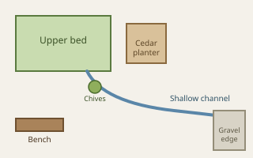

# Garden log

## 18 April

The first warm afternoon after several wet days. The upper bed drained well, but water still gathers for an hour near the cedar planter. The shallow channel added last month is carrying most runoff toward the gravel edge.

Pea shoots are roughly a hand high. Two supports leaned after the rain, so they were reset deeper and tied together across the top. The chives have spread beyond their marker, which is welcome for now but worth dividing in autumn.

### Work completed

- [x] Reset pea supports
- [x] Add leaf mold around the currant
- [x] Clear the drain beside the steps
- [ ] Label the two mint varieties

## Observations

Three beds with the dimensions used in [[Features/block-math|Block math]] would require more soil than this small garden can store at once. Ordering in two deliveries would keep the path usable.

A quick sketch of the layout keeps the drainage line straight in memory before the details fade:

The bench receives shade from about mid-afternoon. That makes it a good place for the seedling tray, provided someone remembers to move the tray before a cold night.

> [!warning] Slug pressure
> New lettuce leaves show fresh damage near the stone border. Check under the boards before adding any barrier.

## Next visit

- Photograph the drainage channel after rain.
- Thin the radishes to a palm-width spacing.
- Bring two weatherproof labels for the mint.
- Note whether the currant mulch remains in place.

The route-card idea in [[Examples/Work/project-ideas|Project ideas]] could use this garden as a short observation stop.

#garden #context/outdoors #practice/log
