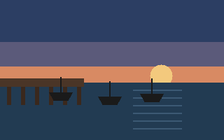

# Harbor weekend plan

## Aim

A quiet two-day visit built around walking, sketching, and a long lunch. The plan leaves room for weather changes instead of filling every hour.

## Saturday

- Arrive before lunch and leave the bag at the guesthouse.
- Walk the upper harbor route, which has benches and several sheltered stops.
- Visit the small maritime gallery if rain becomes steady.
- Choose dinner near the guesthouse rather than crossing town again.

## Sunday

- Start with the eastern breakwater if wind remains light.
- Spend one hour sketching boats, ropes, or rooflines.
- Pick up bread and fruit before the return train.

The western pier holds a rotating handful of moored boats and catches the
sun low over the water in late afternoon, which makes it the better of the
two sketching stops:

## Route alternatives

| Conditions | Route | Approximate character |
| --- | --- | --- |
| Dry and calm | Upper harbor loop | Open views, gradual slope |
| Light rain | Arcade and market streets | Frequent cover, busier |
| Strong wind | Gallery and old town | Mostly indoors or sheltered |

## Packing

- [x] Light rain shell
- [x] Small sketchbook and two pencils
- [ ] Refillable bottle
- [ ] Paperback from the reading stack
- [ ] Check train platform before departure

> [!note]
> Keep one half-day unassigned. The purpose is to notice the place, not complete an itinerary.

Possible observation prompt: follow how rainwater moves from roofs to the harbor. That question also connects to drainage notes in [[Examples/Personal/garden-log|Garden log]].

#travel #context/outdoors
