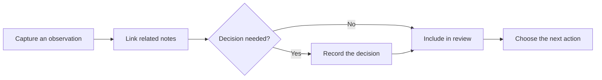

# Mermaid diagram

Mermaid code blocks turn text into diagrams. The source remains readable and easy to revise.

This flow mirrors the relationships between [[Examples/Work/meeting-notes|Meeting notes]], [[Examples/Work/decision-log|Decision log]], and [[Examples/Personal/weekly-review|Weekly review]].

## When diagrams help

Use a diagram for sequence, branching, or ownership that becomes hard to follow in prose. A short list is still the clearest choice for a simple linear procedure.

#feature/diagram #demo
