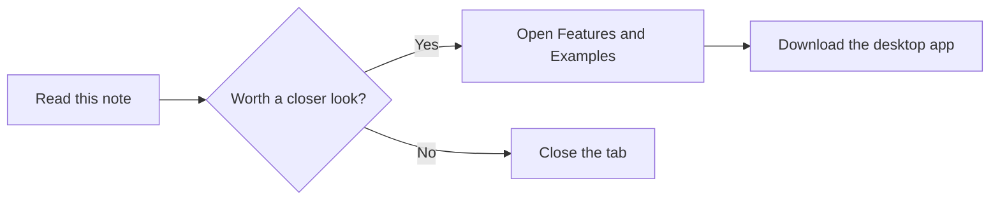

# Showcase

One note, most of what Skribeum renders. Everything below is real,
rendered syntax; nothing here is a picture of a feature.

> [!tip] How to read this note
> Open `mod+e` to see the exact Markdown source behind every block here.

## A decision, at a glance

| Option | Cost | Daylight | Verdict |
| --- | ---: | :---: | --- |
| Cedar Room | Low | Yes | Selected |
| Workshop Bay | Medium | Limited | Backup |

## Work to do

- [x] Draft the showcase note
- [ ] Link it from [[index|the vault index]]
- [ ] Get a second read from [[Examples/Work/decision-log|the decision log]]

## The math behind the seating plan

Row capacity for a room of width $w$ and seat pitch $p$: $n = \lfloor w / p \rfloor$.

$$
n_{total} = \sum_{i=1}^{rows} \lfloor w_i / p \rfloor
$$

## The flow this note supports



## A code example

```ts
export function seatCount(width: number, pitch: number): number {
  return Math.floor(width / pitch);
}
```

#feature/showcase #demo
